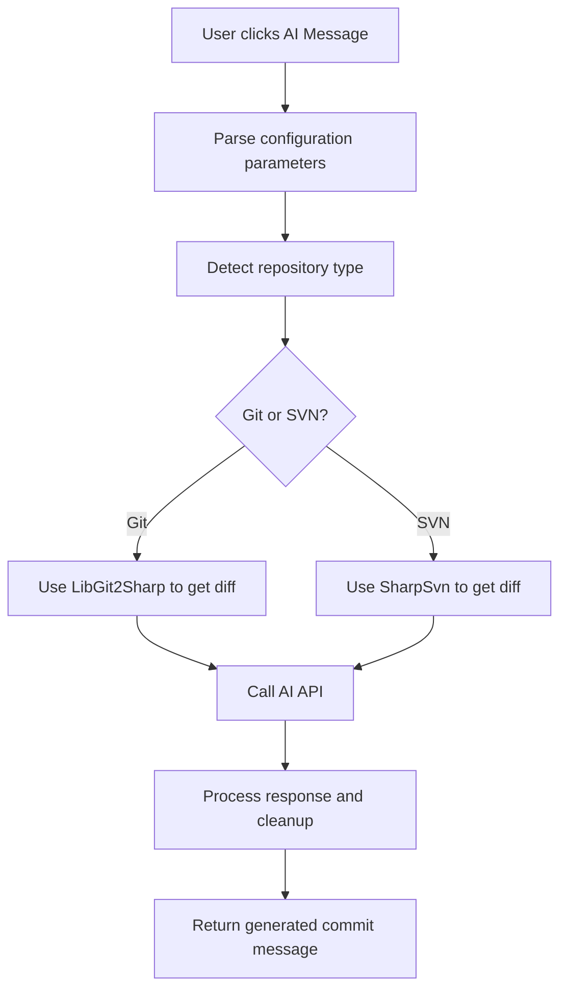

# TSvnCMG - AI Commit Message Generator

[中文](README_CN.md) | English

An intelligent plugin for TortoiseSVN and TortoiseGit that leverages AI technology to automatically generate high-quality commit messages.

## Features

- 🤖 **AI-Powered**: Uses OpenAI-compatible APIs to analyze code diffs and generate commit messages
- 🔄 **Dual Version Control Support**: Supports both Git and SVN repositories
- 🌐 **Multi-language Support**: Configurable to generate commit messages in different languages
- ⚙️ **Highly Configurable**: Supports custom API endpoints, models, and prompts
- 🎯 **Smart Analysis**: Automatically detects repository type and retrieves corresponding code diffs

## System Requirements

- Windows Operating System
- .NET Framework 4.8.1 or higher
- TortoiseSVN or TortoiseGit
- OpenAI API key or compatible API service

## Installation Steps

1. **Compile the Project**
   ```bash
   # Use Visual Studio or MSBuild to compile the project
   msbuild TSvnCMG.sln /p:Configuration=Release
   ```

2. **Register COM Component**
   ```cmd
   # Run Command Prompt as Administrator
   RegAsm bin\Release\TSvnCMG.dll /codebase /regfile:TSvnCMG.reg
   ```
   - Open the `TSvnCMG.reg` file with a text editor
   - Add the following content at the end of the file:
    ```
    [HKEY_CLASSES_ROOT\CLSID\{BCEDE820-24C2-444E-AF71-83F197705116}\Implemented Categories\{3494FA92-B139-4730-9591-01135D5E7831}]
    ``` 
   - Save and close the file
   - Execute the `TSvnCMG.reg` file to register the COM component

3. **Configure TortoiseSVN/TortoiseGit**
   - Open TortoiseSVN/TortoiseGit settings
   - Navigate to "Hook Scripts" -> "Issue Tracker Integration"
   - Add a new Bug Tracking Provider
   - Fill in the configuration parameters in the parameters field
   - **If using with TortoiseGit, you need to enable the `Staging support(EXPERIMENTAL)` option in the Commit window, otherwise the plugin cannot properly retrieve commit changes**

## Configuration Parameters

The plugin is configured through `JSON` format parameters:

Example:
```json
{
  "api_key": "your-openai-api-key",
  "model": "gpt-3.5-turbo",
  "base_url": "https://api.openai.com/v1/",
  "language": "English",
  "prompt": "You are a professional programmer. Generate concise and informative commit messages based on the provided code diff."
}
```

Here's another example using `ollama`:
```json
{
    "api_key":"123",
    "model":"qwen3:4b-think",
    "base_url":"http://localhost:11434/v1/", 
    "language":"English",
    "max_tokens": 8192
}
```

Notes:
- Please ensure to keep the trailing "/" in `base_url`.
- You need to minify the above JSON before pasting it into the `parameters` field. You can use [json_minify](https://it-tools.tech/json-minify) or similar tools.

### Parameter Description

| Parameter    | Type   | Required | Description                                  |
| ------------ | ------ | -------- | -------------------------------------------- |
| `api_key`    | string | ✅        | OpenAI API key                               |
| `model`      | string | ✅        | AI model to use (e.g., gpt-3.5-turbo, gpt-4) |
| `base_url`   | string | ✅        | API base URL                                 |
| `language`   | string | ❌        | Language for generated commit messages       |
| `prompt`     | string | ❌        | Custom system prompt                         |
| `max_tokens` | int    | ❌        | Maximum token limit                          |

## Usage

1. Start a commit operation in TortoiseSVN or TortoiseGit
2. Click the "AI Message" button in the commit dialog
3. The plugin will automatically:
   - Detect repository type (Git or SVN)
   - Retrieve code differences
   - Call AI API to generate commit message
   - Fill the generated message into the commit box

## Technical Architecture

### Core Components

- **AIMessageProvider.cs**: Main COM component implementing IBugTraqProvider interface
- **OpenAIConfig.cs**: Configuration data models and API response structures
- **LoadingForm.cs**: Loading interface for asynchronous AI request processing

### Dependencies

- **LibGit2Sharp**: Git repository operations
- **SharpSvn**: SVN repository operations  
- **Newtonsoft.Json**: JSON serialization/deserialization
- **System.Net.Http**: HTTP API calls

### Workflow



## Development Guide

### Building the Project

```bash
# Clone repository
git clone <repository-url>
cd TSvnCMG

# Restore NuGet packages
nuget restore

# Compile project
msbuild TSvnCMG.sln /p:Configuration=Release /p:Platform="x64"
```

### Debugging

1. Set breakpoints in Visual Studio
2. Register the compiled DLL as a COM component
3. Trigger plugin functionality in TortoiseSVN/TortoiseGit

### Extending Functionality

To add new features:

1. Modify the `OpenAIConfig` class to add new configuration options
2. Implement new logic in `AIMessageProvider`
3. Update `LoadingForm` to support new UI requirements

## Troubleshooting

### Common Issues

**Q: Plugin fails to load**
A: Ensure the COM component is properly registered and .NET Framework version is compatible

**Q: API call fails**
A: Check network connection, API key validity, and configuration parameter format

**Q: Cannot retrieve code diff**
A: Ensure the current directory is a valid Git or SVN repository

### Logging and Debugging

The plugin displays error messages through MessageBox. For detailed debugging:

1. Use Visual Studio to attach to TortoiseSVN/TortoiseGit process
2. Set breakpoints in key methods
3. Check exception details and call stack

## License

This project is licensed under the [MIT] License. See the LICENSE file for details.

## Contributing

Issues and Pull Requests are welcome!

1. Fork this repository
2. Create a feature branch (`git checkout -b feature/AmazingFeature`)
3. Commit your changes (`git commit -m 'Add some AmazingFeature'`)
4. Push to the branch (`git push origin feature/AmazingFeature`)
5. Open a Pull Request

## Changelog

### v1.0.0
- Initial release
- Support for Git and SVN repositories
- OpenAI API integration
- Multi-language commit message generation

---

**Note**: Using this plugin requires a valid OpenAI API key or compatible API service. Please ensure compliance with the terms of service of the respective services.