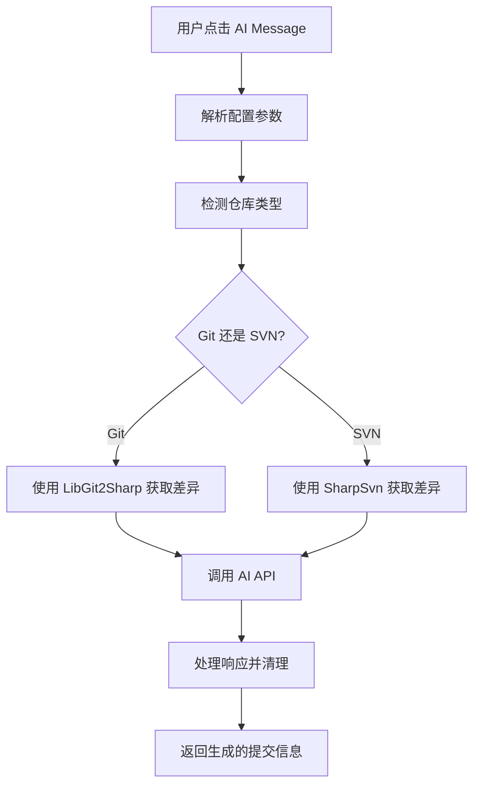

# TSvnCMG - AI 提交信息生成器

中文 | [English](README.md)

一个用于 TortoiseSVN 和 TortoiseGit 的智能插件，利用 AI 技术自动生成高质量的提交信息。

## 功能特性

- 🤖 **AI 驱动**: 使用 OpenAI 兼容的 API 分析代码差异并生成提交信息
- 🔄 **双版本控制支持**: 同时支持 Git 和 SVN 仓库
- 🌐 **多语言支持**: 可配置生成不同语言的提交信息
- ⚙️ **高度可配置**: 支持自定义 API 端点、模型和提示词
- 🎯 **智能分析**: 自动检测仓库类型并获取相应的代码差异

## 系统要求

- Windows 操作系统
- .NET Framework 4.8.1 或更高版本
- TortoiseSVN 或 TortoiseGit
- OpenAI API 密钥或兼容的 API 服务

## 安装步骤

1. **编译项目**
   ```bash
   # 使用 Visual Studio 或 MSBuild 编译项目
   msbuild TSvnCMG.sln /p:Configuration=Release
   ```

2. **注册 COM 组件**
   ```cmd
   # 以管理员身份运行命令提示符
   RegAsm bin\Release\TSvnCMG.dll /codebase /regfile:TSvnCMG.reg
   ```
   - 使用文本编辑器打开 `TSvnCMG.reg` 文件
   - 在文件最后添加以下内容:
    ```
    [HKEY_CLASSES_ROOT\CLSID\{BCEDE820-24C2-444E-AF71-83F197705116}\Implemented Categories\{3494FA92-B139-4730-9591-01135D5E7831}]
    ``` 
   - 保存文件并关闭
   - 执行 `TSvnCMG.reg` 文件以注册 COM 组件

3. **配置 TortoiseSVN/TortoiseGit**
   - 打开 TortoiseSVN/TortoiseGit 设置
   - 导航到 "Hook Scripts" -> "Issue Tracker Integration"
   - 添加新的 Bug Tracking Provider
   - 在parameters中填入下面的配置参数
   - **如果在TortoiseGit中使用，需要在Commit窗口中启用`Staging support(EXPERIMENTAL)`选项，否则插件无法正常获取提交的变更**

## 配置参数

插件通过 `JSON` 格式的参数进行配置：

示例：
```json
{
  "api_key": "your-openai-api-key",
  "model": "gpt-3.5-turbo",
  "base_url": "https://api.openai.com/v1/",
  "language": "中文",
  "prompt": "你是一个专业的程序员。请根据提供的代码差异生成简洁且信息丰富的提交信息。",
  
}
```

这是另一个使用`ollama`的示例：
```
{
    "api_key":"123","model":"qwen3:4b-think","base_url":"http://localhost:11434/v1/", "language":"English",
    "max_tokens": 8192
}
```

注意
- `base_url`请务必保留最后的"/"。
- 需要将上述`Json` minify以后粘贴到`parameters`中。可以使用[json_minify](https://it-tools.tech/json-minify)或其他类似工具。

### 参数说明

| 参数 | 类型 | 必需 | 说明 |
|------|------|------|------|
| `api_key` | string | ✅ | OpenAI API 密钥 |
| `model` | string | ✅ | 使用的 AI 模型（如 gpt-3.5-turbo, gpt-4） |
| `base_url` | string | ✅ | API 基础 URL |
| `language` | string | ❌ | 生成提交信息的语言 |
| `prompt` | string | ❌ | 自定义系统提示词 |
| `max_tokens` | int | ❌ | 最大令牌数限制 |

## 使用方法

1. 在 TortoiseSVN 或 TortoiseGit 中开始提交操作
2. 在提交对话框中点击 "AI Message" 按钮
3. 插件会自动：
   - 检测仓库类型（Git 或 SVN）
   - 获取代码差异
   - 调用 AI API 生成提交信息
   - 将生成的信息填入提交框

## 技术架构

### 核心组件

- **AIMessageProvider.cs**: 主要的 COM 组件，实现 IBugTraqProvider 接口
- **OpenAIConfig.cs**: 配置数据模型和 API 响应结构
- **LoadingForm.cs**: 异步处理 AI 请求的加载界面

### 依赖项

- **LibGit2Sharp**: Git 仓库操作
- **SharpSvn**: SVN 仓库操作  
- **Newtonsoft.Json**: JSON 序列化/反序列化
- **System.Net.Http**: HTTP API 调用

### 工作流程



## 开发指南

### 构建项目

```bash
# 克隆仓库
git clone <repository-url>
cd TSvnCMG

# 还原 NuGet 包
nuget restore

# 编译项目
msbuild TSvnCMG.sln /p:Configuration=Release /p:Platform="x64"
```

### 调试

1. 在 Visual Studio 中设置断点
2. 将编译后的 DLL 注册为 COM 组件
3. 在 TortoiseSVN/TortoiseGit 中触发插件功能

### 扩展功能

要添加新功能，可以：

1. 修改 `OpenAIConfig` 类添加新的配置选项
2. 在 `AIMessageProvider` 中实现新的逻辑
3. 更新 `LoadingForm` 以支持新的 UI 需求

## 故障排除

### 常见问题

**Q: 插件无法加载**
A: 确保已正确注册 COM 组件，并且 .NET Framework 版本兼容

**Q: API 调用失败**
A: 检查网络连接、API 密钥有效性和配置参数格式

**Q: 无法获取代码差异**
A: 确保当前目录是有效的 Git 或 SVN 仓库

### 日志和调试

插件会通过 MessageBox 显示错误信息。对于详细调试：

1. 使用 Visual Studio 附加到 TortoiseSVN/TortoiseGit 进程
2. 在关键方法设置断点
3. 检查异常详情和调用堆栈

## 许可证

本项目采用 [MIT] 许可证。详情请参阅 LICENSE 文件。

## 贡献

欢迎提交 Issue 和 Pull Request！

1. Fork 本仓库
2. 创建功能分支 (`git checkout -b feature/AmazingFeature`)
3. 提交更改 (`git commit -m 'Add some AmazingFeature'`)
4. 推送到分支 (`git push origin feature/AmazingFeature`)
5. 开启 Pull Request

## 更新日志

### v1.0.0
- 初始版本发布
- 支持 Git 和 SVN 仓库
- OpenAI API 集成
- 多语言提交信息生成

---

**注意**: 使用本插件需要有效的 OpenAI API 密钥或兼容的 API 服务。请确保遵守相关服务的使用条款。